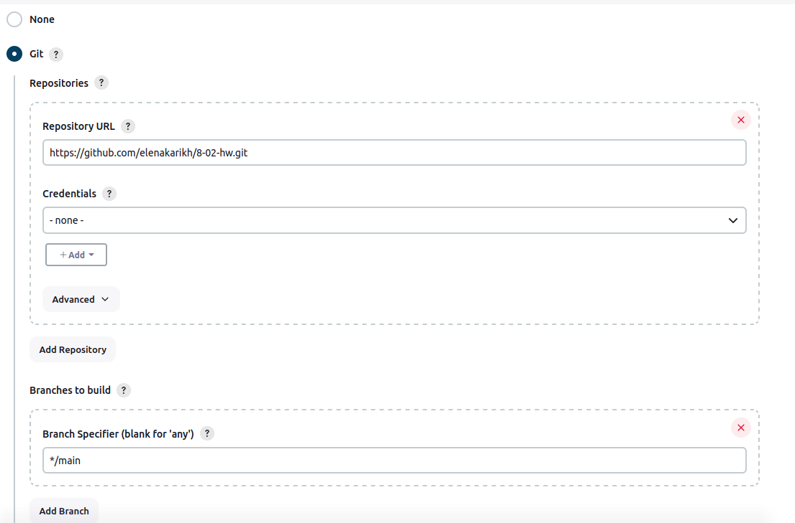
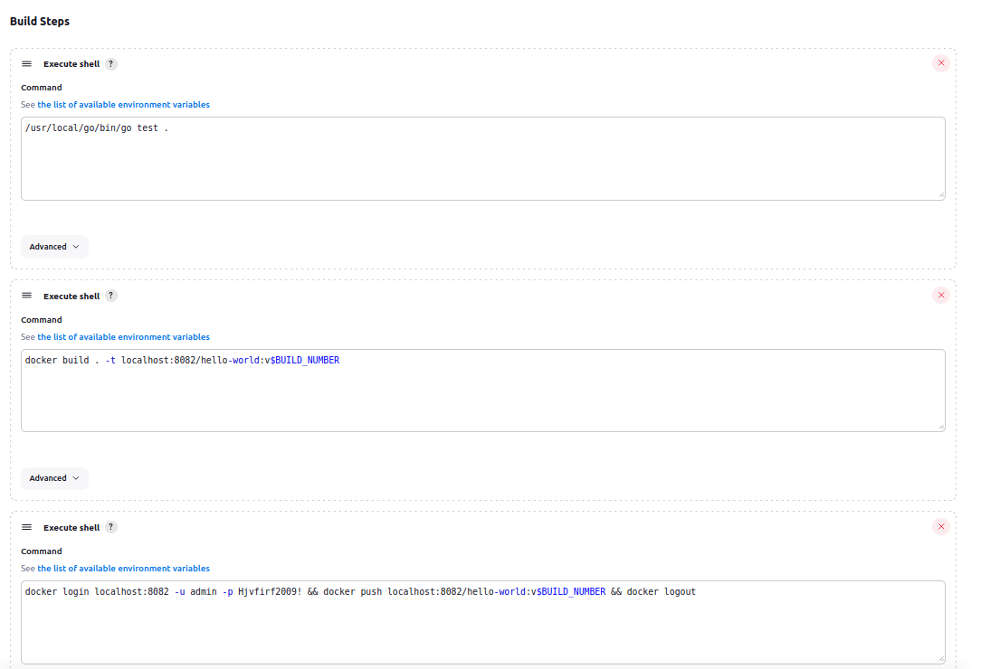
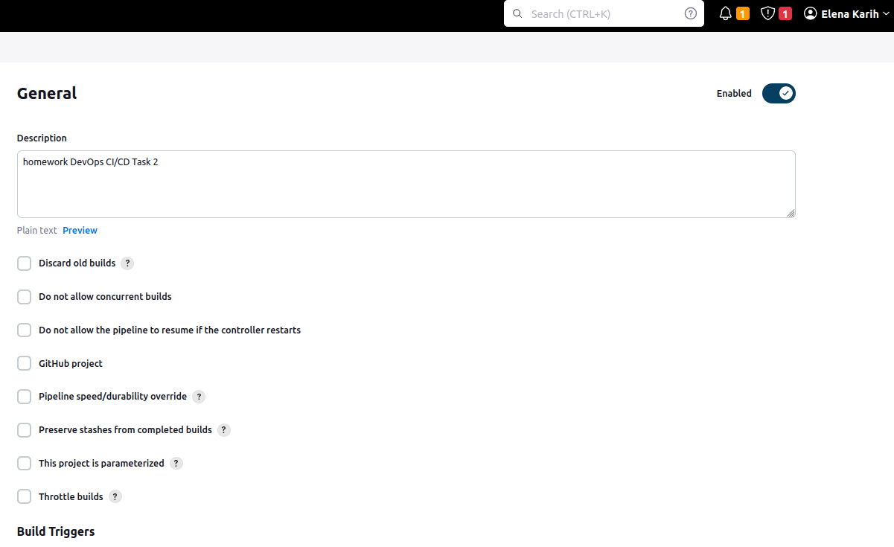
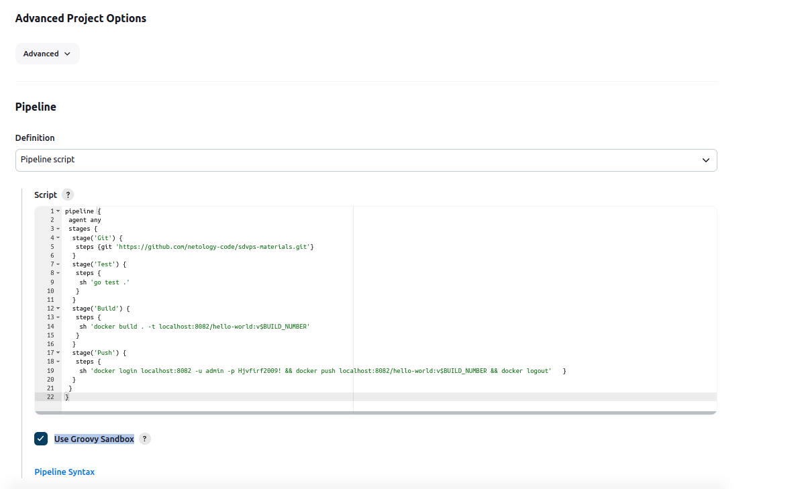
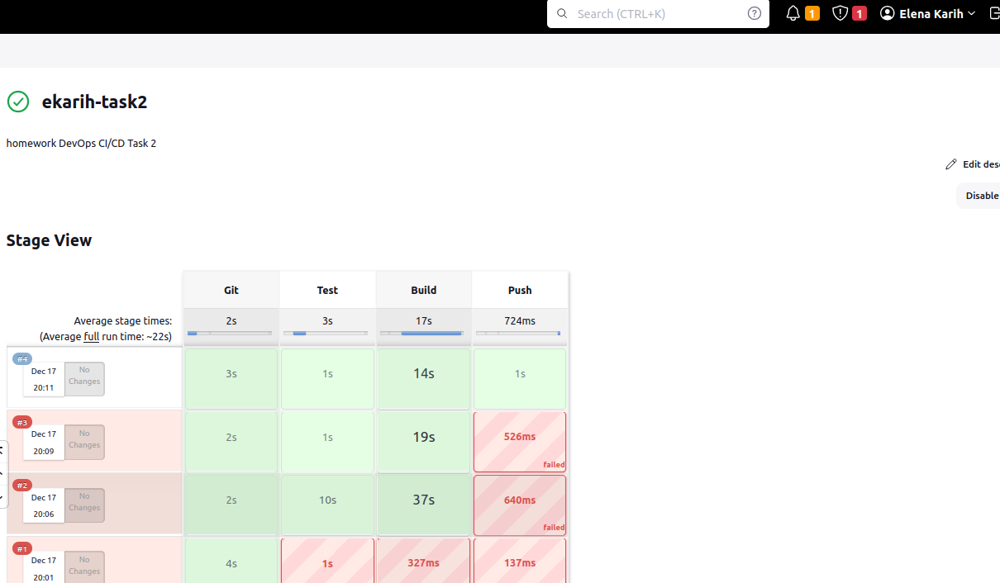
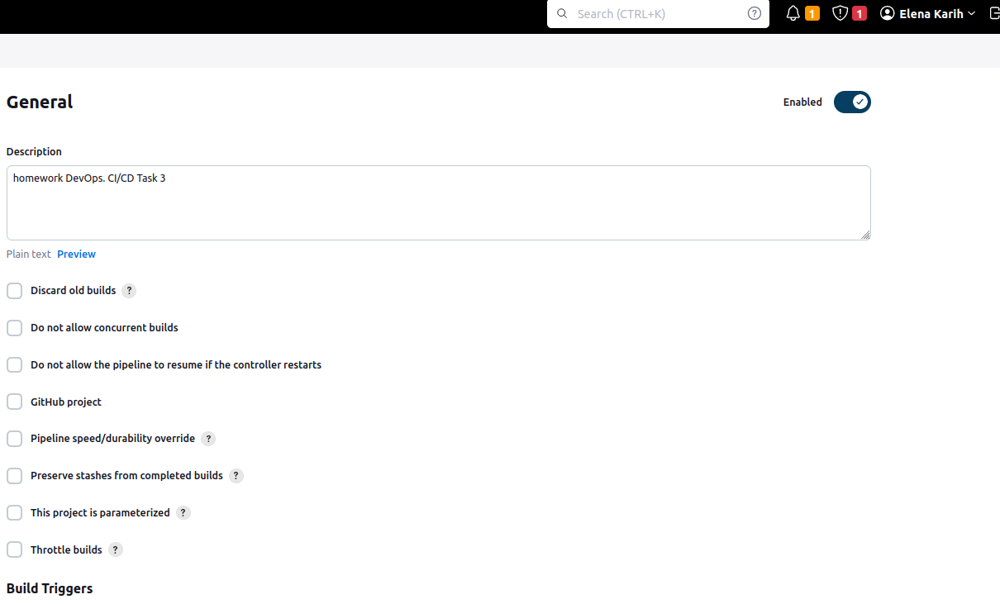
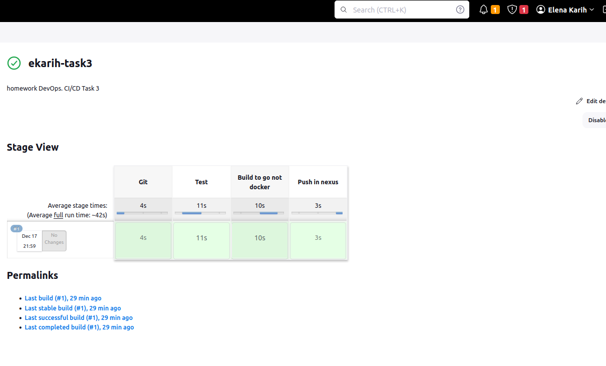
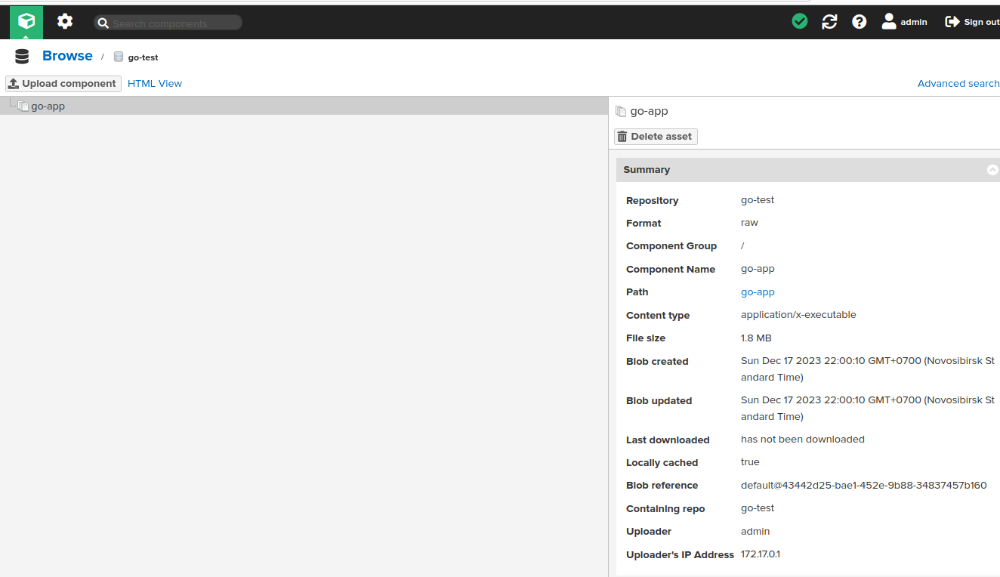
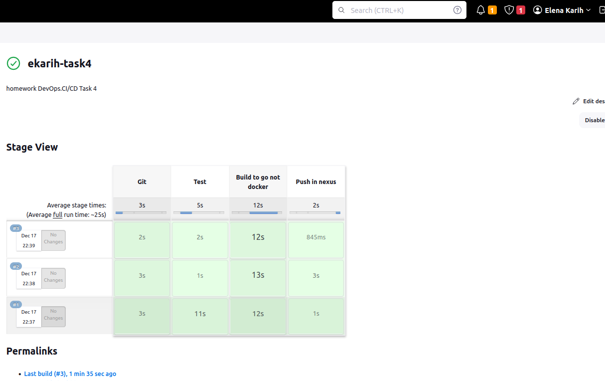
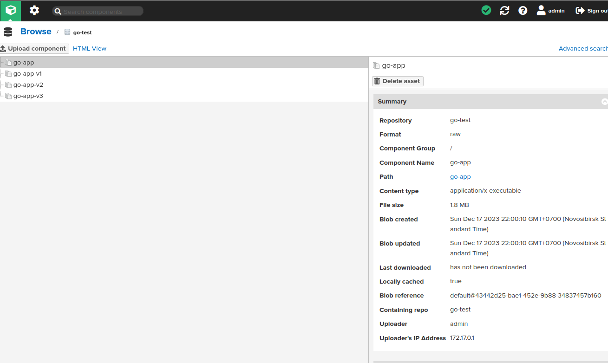

# Домашнее задание "Что такое DevOps. CI/CD" - Карих Елена
  Netology
```
## Задание 1

1. Установите себе jenkins по инструкции из лекции или любым другим способом из официальной документации. Использовать Docker в этом задании нежелательно.
2. Установите на машину с jenkins golang.
3. Используя свой аккаунт на GitHub, сделайте себе форк репозитория. В этом же репозитории находится дополнительный материал для выполнения ДЗ.
4. Создайте в jenkins Freestyle Project, подключите получившийся репозиторий к нему и произведите запуск тестов и сборку проекта go test . и docker build ..

   В качестве ответа пришлите скриншоты с настройками проекта и результатами выполнения сборки.

## Решение 1

Настройки проекта:



Результат сборки:


## Задание 2

1. Создайте новый проект pipeline.
2. Перепишите сборку из задания 1 на declarative в виде кода.

В качестве ответа пришлите скриншоты с настройками проекта и результатами выполнения сборки.

## Решение 2

Настройки проекта:


Результат сборки:


## Задание 3

1. Установите на машину Nexus.
2. Создайте raw-hosted репозиторий.
3. Измените pipeline так, чтобы вместо Docker-образа собирался бинарный go-файл. Команду можно скопировать из Dockerfile.
4. Загрузите файл в репозиторий с помощью jenkins.

В качестве ответа пришлите скриншоты с настройками проекта и результатами выполнения сборки.

## Решение 3

Настройки проекта:


Результат сборки:

Nexus Repositories:


## Задание 4

Придумайте способ версионировать приложение, чтобы каждый следующий запуск сборки присваивал имени файла новую версию. Таким образом, в репозитории Nexus будет храниться история релизов.
Подсказка: используйте переменную BUILD_NUMBER.

В качестве ответа пришлите скриншоты с настройками проекта и результатами выполнения сборки.

## Решение 3

Эх, с такой подсказкой, оказалось все сразу понятно)) Спасибо)) 
Настройки проекта:

Результат сборки:

Nexus Repositories:

